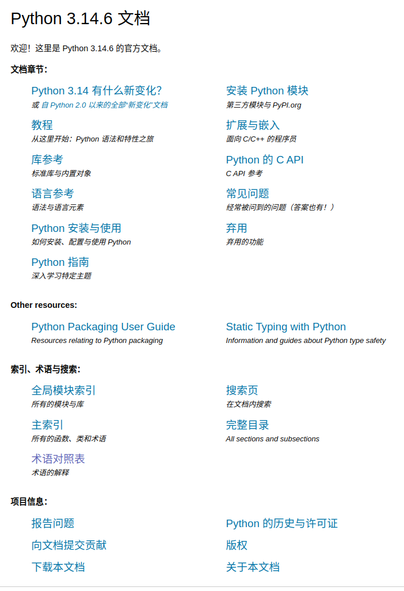

# Python 官方文档

关于 Python 语言及标准库最权威的资源是 Python 官方文档，入口和中文翻译地址如下：

语言 | 地址 | 说明 |
:-|:-|:-
英文|[https://docs.python.org/](https://docs.python.org/)  | 官方主站，内容最完整、更新最快，为当前稳定版本的文档。 
中文|[https://docs.python.org/zh-cn/](https://docs.python.org/zh-cn/)  | 官方维护的中文翻译，方便阅读 。

几点提示：
*   版本切换：访问上述网址后，可以通过页面左上角的 `Language` 下拉菜单随时切换语言。页面顶部通常也可以切换不同 Python 版本的文档；
*   内容差异：中文文档的翻译工作仍在持续完善中，一些高阶内容（如 Python/C API）可能仍是英文原文 。最完整的信息始终以英文版为准；
*   可以下载离线阅读。

